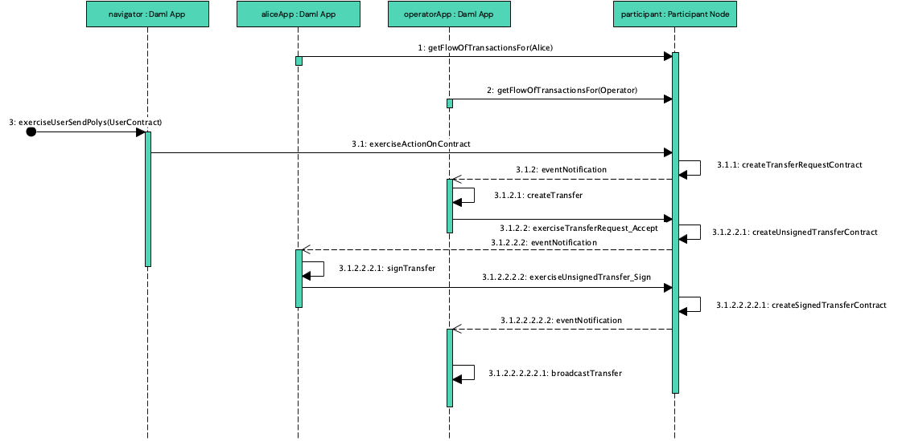

# daml-topl-lib-java

daml-topl-lib is a set of [DAML Modules](https://www.digitalasset.com/developers) for interfacing with the Topl blockchain and the DAML ledger. It includes a reference application. The App is implemented in Java using DAML's Java bindings for interaction with the DAML ledger, and brambl for using bifrost gRPC API. The code, design and documentation of this library is heavily inspired by [Hemera](https://github.com/liakakos/hemera), a DAML Library for Ethereum integration.

## The DAML Topl Library

The DAML Topl library is meant for a single operator and multiple user parties. The operator and the users establish a contract which allows the users to request the execution of certain operations by the operator through exercising their choices (rights) on the contract. The operator, on the other hand, performs operations on the Topl network and gets the results in the form of contract responses.

### Onboarding

The possible interactions among users in DAML are defined through contracts. For a user to be able to request something from an operator, there must be a contract that establishes what can be rights can be exercised by the user and the operator. In this case, the contract is the `User` template. To sign the `User` contract, the operator first creates an instance of the `Operator` template, exercises the `Operator_InviteUser` choice. This creates `UserInvitation` contract, which is accepted by the user by exercising the choice `UserInvitation_Accept`. The latter choice creates the `User` contract.

### Transfer

If the user wants to send polys to an address they use the Transfer module. The mechanics is the following:

- On the `User` contract, the user exercises the choice `User_SendPolys` with the data for the transfer (from and to addresses, amount, fees, etc), which creates a `TransferRequest` contract,
- The `TransferRequest` is accepted by the operator and an `UnsignedTransfer` is created.
- The `UnsignedTransfer` is then signed by the user by exercising the `UnsignedTransfer_Sign` choice, creating a `SignedTransfer`.
- Finally, the controller broadcasts the `SignedTransfer`to the network.


## Getting started

### 1. Environment

To run the daml-topl-lib, the DAML SDK (version >  2.3.2) must be installed on your system. The Java app is a mixed Java and Scala project, that uses Maven as the build tool. You need Maven installed to compile and execute the various targets.

### 2. Compile

Three steps are required to compile:

1. Build the DAML module. This will compile the DAML code to a DAR file. This step is required for the code generation. This is done with the `daml` tool:

```shell
$ daml build
```

2. Generate the Java code. This will generate the Java classes corresponding to the DAML contracts.

```shell
$ mvn clean
# some response [..]
$ daml codegen java
```

3. Compile the Java/Scala code. Please do not clean here because it will remove the generated Java code.

```shell
$ mvn compile
```

### 3. Run the DAML sandbox and navigator

To test the code, we need a server implementing the DAML Ledger API. This server is called the DAML sandbox. To run it we execute the command:

```shell
$ daml start
```

This command will also start the Navigator. A component that allows to see the status of the DAML ledger. Upon initialization, the DAML sandbox will execute the initialize script in the `Main.daml` file. The script is shown below:

```haskell
initialize = do
      operator <- allocateParty "Operator"
      operatorId <- validateUserId "operator"
      alice <- allocateParty "Alice"
      aliceId <- validateUserId "alice"
      operatorCid <- submit operator do
        createCmd Operator with operator
      userInvitationCid <- submit operator do
        exerciseCmd operatorCid  Operator_InviteUser 
          with user = alice
      aliceUserCid <- submit alice do
        exerciseCmd userInvitationCid UserInvitation_Accept
      createUser (Daml.Script.User aliceId (Some alice)) [CanActAs alice]
      createUser (Daml.Script.User operatorId (Some operator)) [CanActAs operator]
      pure [alice]
```

The script creates two parties, Alice and Operator, and the executes the onboarding flow. After this script is run, we can directly exercise the choices in the `User` contract.

### 4. Running the Operator App

The operator will be connecting to the Topl network, so it needs some extra information like the Topl `ProjectId` and the API key. This information is passed through environment variables. Before running the Operator App, you need to export the following environment variables:

```bash
export TOPL_PROJECT_ID="<Topl Project ID>"
export TOPL_API_KEY="<Topl API Key>"
```

Once the variables are exported, the operator app can be run with the following command:

```shell
$ mvn compile exec:java -Doperator
```

### 5. Running the Alice App

The Alice app will be signing the transactions to be sent to the network. For this, it needs some extra information: a keyfile and a password. By default, the keyfile is called `keyfile.json` and it must be at the root of the project to be loaded by the Alice App. The keyfile must be provided by the user. The password is also provided as an environment variable. The following variables must then be exported before:

```bash
export TOPL_PROJECT_ID="<Topl Project ID>"
export TOPL_API_KEY="<Topl API Key>"
export KEY_PASSWORD="<keyfile password>"
```

Once the variables are exported and the keyfile is at the right place, we can run the following command:

```shell
$ mvn compile exec:java -Dalice
```

### 6. Full execution flow

An example execution of the whole flow can be seen in the image below:


